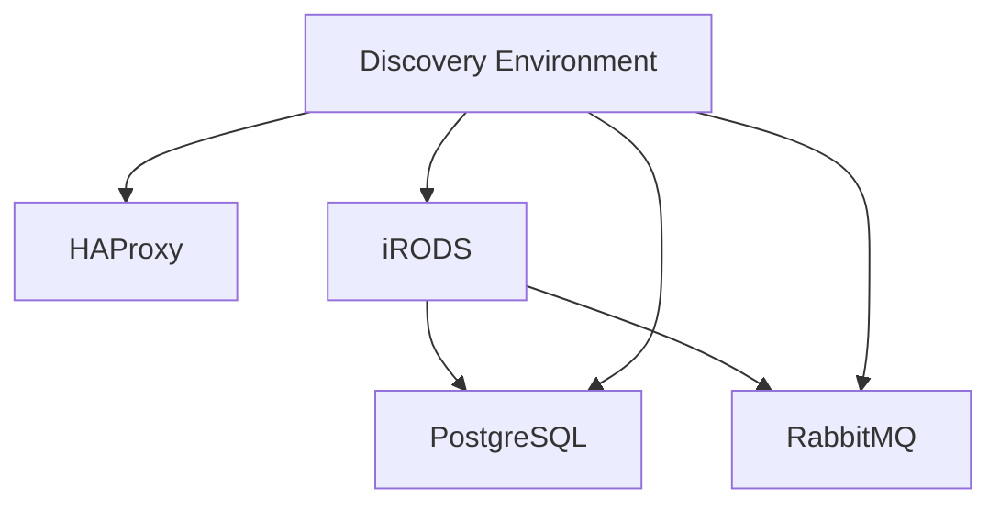

# Components

A minimal CyVerse deployment is five moving parts plus the DE service set:

| Component | Role |
|-----------|------|
| HAProxy | Single public entry point; terminates HTTPS and forwards to cluster node ports |
| PostgreSQL | Catalog (iCAT) database plus one database per DE service |
| RabbitMQ | AMQP message bus between iRODS, the DE, and indexing services |
| iRODS 4.3.3 | Data Store catalog provider and storage vault |
| Discovery Environment | The DE service set, split into non-analysis services and analyses (VICE) |

# Resource requirements

Per-component requirements, as sized for the two-node pilot:

| Component | Cores | Memory | Storage |
|-----------|------:|-------:|--------:|
| HAProxy | 4 | 8 GB | — |
| PostgreSQL | 22 | 56 GB | 510 GB |
| RabbitMQ | 1 | 2 GB | 20 GB |
| iRODS | 20 | 120 GB | 110 TB |
| DE without analyses | 24 | 56 GB | 1.4 TB |
| DE analyses (VICE) | 48 | 192 GB | 3 TB |

!!! note "Storage figure for iRODS"

    The pilot record quotes iRODS storage as both 100 TB and 110 TB. 110 TB is
    the figure its own totals are computed from, so that is what this table
    carries. Treat it as the data vault target for a pilot, not a fixed
    requirement — the vault is sized to the science, and is the one number that
    grows without bound.

## Two-node allocation

The pilot placed everything except analyses on the first node:

| First node (`core-1`) | Cores | Memory | Storage |
|-----------------------|------:|-------:|--------:|
| Physical capacity | 192 | 2.3 TB | 610 TB |
| Required by HAProxy, PostgreSQL, RabbitMQ | 27 | 66 GB | 530 GB |
| Required by iRODS | 20 | 120 GB | 110 TB |
| Required by DE (no analyses) | 24 | 56 GB | 1.4 TB |
| **Total required** | **71** | **242 GB** | **112 TB** |
| Over-allocation ratio (capacity ÷ required) | 2.7× | 9.5× | 5.4× |

The totals are the exact sums of the rows above them; the pilot record rounded
them to 250 GB and 120 TB, which shifts the storage ratio it quotes from 5.4×
to 5.0×. Nothing downstream depends on the rounding.

Headroom is not left idle. The pilot reserved the surplus by workload so that
one component cannot starve another:

| Reservation | Cores | Memory | Storage |
|-------------|------:|-------:|--------:|
| Scaled iRODS reservation | 54 | 1.2 TB | 550 TB |
| Scaled DE reservation | 65 | 540 GB | 7 TB |
| Unreserved (HAProxy, PostgreSQL, RabbitMQ) | 73 | 560 GB | 53 TB |

The second node carries only DE analyses, and is sized from the DE analyses row
above plus whatever concurrency target the site sets for VICE.

!!! tip "Deriving PostgreSQL settings from this table"

    Several `postgresql.conf` values are functions of the memory and cores
    reserved for the database rather than of total machine capacity — see
    [PostgreSQL tuning](../deployment/01-foundation/postgresql.md#tuning).
    Decide the reservation first, then compute.

# Dependencies

Read as "depends on":

* **iRODS** → PostgreSQL, RabbitMQ
* **Discovery Environment** → HAProxy, PostgreSQL, RabbitMQ, iRODS

That graph is why the deployment order in
[deployment](../deployment/index.md) is what it is: nothing in a later phase
can come up before its dependencies in an earlier one.

# Beyond the pilot

The two-node shape is the smallest useful deployment, not the production
target. Scaling is additive rather than a redesign:

* More VICE capacity means more workers in the `k8s_vice_workers` inventory
  group.
* More data capacity means more iRODS resources, which may live on separate
  hardware in the same zone.
* Separating PostgreSQL onto its own host is the first split most sites make,
  because the DE and the catalog compete for the same buffer cache.

For the shape of the production US CyVerse deployment, see
[system overview](./system-overview.md).
