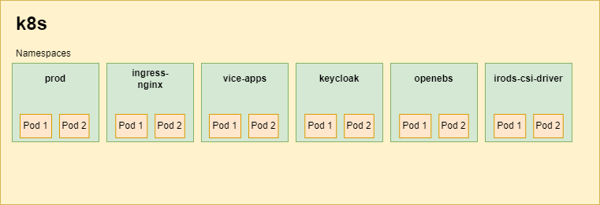

# How namespaces are used

CyVerse groups workloads into namespaces along two lines: what has to be isolated
for security (user containers), and what has its own lifecycle (add-ons that are
installed and upgraded independently of the DE service set).

The DE service namespace is conventionally `prod`. A site running more than one
environment in a cluster names its namespaces after the environments; where a
document in this bundle says `<NAMESPACE>`, that is the choice it refers to.

# The DE service namespace

`prod` in a standard deployment. It holds the DE service set and the supporting
services the DE talks to directly:

| Workload | Document |
|----------|----------|
| DE services (Terrain, apps, analyses, metadata, notifications, search, UI) | [Discovery Environment](../deployment/06-applications/discovery-environment.md) |
| `de-nginx` front end | [Discovery Environment](../deployment/06-applications/discovery-environment.md) |
| Redis and Redis HAProxy | [Redis HA](../deployment/05-core-services/redis-ha.md) |
| Search cluster | [OpenSearch](../deployment/05-core-services/opensearch.md) |
| Grouper loader and web services | [Grouper](../deployment/05-core-services/grouper.md) |
| Unleash | [Unleash](../deployment/05-core-services/unleash.md) |
| NATS | [NATS](../deployment/05-core-services/nats.md) |
| User Portal (or its own `user-portal` namespace) | [User Portal](../deployment/06-applications/user-portal.md) |

# Dedicated namespaces

| Namespace | Contents | Why it is separate |
|-----------|----------|--------------------|
| `vice-apps` | Interactive analyses, `app-exposer`, the VICE operator | User-supplied containers need their own network policy and service accounts — see [VICE](../deployment/06-applications/vice.md) |
| `keycloak` | Keycloak | Authentication is upgraded on its own schedule — see [Keycloak](../deployment/05-core-services/keycloak.md) |
| `openldap` | OpenLDAP | System of record for accounts — see [OpenLDAP](../deployment/05-core-services/openldap.md) |
| `irods-csi-driver` | The iRODS CSI driver | Node-level storage plugin with its own upgrade procedure — see [iRODS CSI driver](../deployment/05-core-services/irods-csi-driver.md) |
| `longhorn-system` | Longhorn | Cluster storage — see [storage](../deployment/04-kubernetes/storage.md) |
| `openebs` | OpenEBS (legacy) | Older cluster storage — see [storage](../deployment/04-kubernetes/storage.md) |
| `ingress-nginx` | ingress-nginx | VICE ingresses; being retired — see [ingress](../deployment/04-kubernetes/ingress.md) |
| `cert-manager` | cert-manager and cluster issuers | TLS issuance — see [cert-manager](../deployment/04-kubernetes/cert-manager.md) |
| `argo` | Argo Workflows | Batch analyses — see [Argo](../deployment/04-kubernetes/argo.md) |
| `harbor` | Harbor registry | Registry lifecycle — see [Harbor](../deployment/04-kubernetes/harbor.md) |
| `mail` | exim4 smarthost | Optional; see [mail](../deployment/05-core-services/mail.md) |
| `jaeger` | Jaeger collector, query, rollover cron | Optional tracing — see [Jaeger](../deployment/05-core-services/jaeger.md) |

Which of these exist depends on what you deployed: Longhorn or OpenEBS, OpenSearch
or Elasticsearch, mail and tracing only if installed.

# Practical notes

* **Namespaced manifests.** Several manifests in
  [cluster resources](../deployment/04-kubernetes/resources.md) carry a namespace
  in a kustomization or in an argument. Deploying into a namespace other than the
  default means changing them; each document flags where.
* **Cross-namespace addresses.** In-cluster names are
  `<service>.<namespace>` — `ldap://openldap.openldap` for the directory,
  `http://vice-operator.vice-apps:10000` for the VICE operator.
* **`kubectl` scope.** Most troubleshooting starts with
  `kubectl get pods -A`; per-namespace commands in this bundle use `<NAMESPACE>`
  wherever the value is a site choice.

# Related

* [System overview](./system-overview.md)
* [Deployment](../deployment/index.md)
* [Network requirements](./network-requirements.md)
