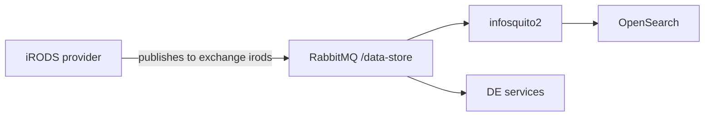

# Prerequisites

A working [iRODS catalog provider](./irods-provider.md) with the zone
initialized.

# Specific queries

The DE relies on iRODS *specific queries* — named SQL registered in the catalog
— for listings that the general query interface cannot express efficiently, such
as counting collections beneath a path.

The queries live in `playbooks/files/irods/specific-queries` in the
[Data Store collection](https://github.com/cyverse/ds-collection).[^ds-collection]
Each file name is the query alias and the file contents are the query, so
installation is mechanical:

```bash
iadmin asq "$(cat IPCCountCollectionsUnderPath.sql)" IPCCountCollectionsUnderPath
```

Repeat for every file in that directory. Missing a query does not break iRODS —
it breaks a specific DE listing later, with an error that does not obviously
point back here, so install them all in one pass and verify with `iadmin lsq`.

# DE service account

The DE authenticates to iRODS as a dedicated `rodsadmin` account rather than as
`rods`:

```bash
iadmin mkuser de-irods rodsadmin
iadmin moduser de-irods password '<GENERATED_SECRET>'
iadmin atg rodsadmin de-irods
```

The same password goes into the DE's group variables (the `IRODS` section of the
deployment configuration; see
[cluster resources](../04-kubernetes/resources.md)) and into the
`porklock-config` secret used by analysis data transfers (see
[VICE](../06-applications/vice.md)).

!!! warning "One account, several consumers"

    `de-irods` credentials appear in the DE configuration, in the VICE
    `porklock-config` secret, and in the iRODS CSI driver values. Rotating the
    password means updating all three and restarting the services that read
    them.

# Catalog read access

The DE also reads the catalog database directly for some queries, using the
PostgreSQL role with `SELECT` on all iCAT tables created in
[PostgreSQL](../01-foundation/postgresql.md#prepare-for-irods). That role is
separate from `de-irods` and has no write access to the catalog — anything that
writes goes through the iRODS protocol so that policy applies.

# Event flow



Data events published by iRODS policy drive search indexing and DE
notifications. If search results go stale, the usual causes are in that chain:
the AMQP URI in `server_config.json`, the exchange, or a stopped indexer. See
[RabbitMQ operations](../01-foundation/rabbitmq.md#operations-reindex-search)
for triggering a full reindex.

# Related

* [iRODS CSI driver](../05-core-services/irods-csi-driver.md)
* [Discovery Environment deployment](../06-applications/discovery-environment.md)
* [Deploying from scratch](../from-scratch.md#35-prepare-irods-for-the-de)

[^ds-collection]: CyVerse Data Store collection (playbooks and iRODS policy)
