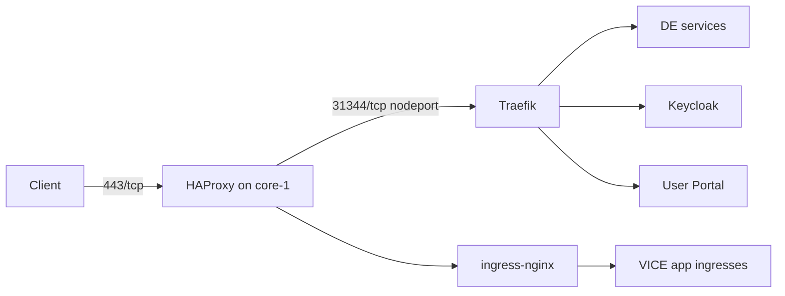

# The path a request takes



Three pieces, each with a distinct job:

* **[HAProxy](../01-foundation/haproxy.md)** is the public entry point on the
  host, listening on `80` and `443`.
* **Traefik** is the in-cluster ingress controller, reached through node ports
  (`31343` HTTP, `31344` HTTPS by default).
* **ingress-nginx** still handles VICE app ingresses and is being retired.

# Traefik

```bash
ansible-playbook -i /path/to/inventory --tags traefik kubernetes.yml
```

Install it after [cert-manager](./cert-manager.md), so routes can reference the
certificates they need at creation time.

The node ports are configurable. If you change them, change the HAProxy back end
to match, and reopen the firewall on the new ports — see
[network requirements](../../architecture/network-requirements.md).

Verify:

```bash
kubectl get svc -A | grep -i traefik
kubectl get ingressroute -A
```

# ingress-nginx (transitional)

ingress-nginx gives VICE apps their per-analysis ingresses. Traefik is intended
to take this over, and the deployment tag remains only until that migration
completes.

```bash
ansible-playbook -i /path/to/inventory --tags ingress-nginx kubernetes.yml
```

The kustomize manifests are in the
[cluster resources](./resources.md) repository. If you deploy into a namespace
other than `prod`, the default backend argument has to follow:

```diff
- --default-backend-service=prod/vice-default-backend
+ --default-backend-service=<NAMESPACE>/vice-default-backend
```

Applying the overlay creates the `ingress-nginx` namespace.

!!! warning "Do not build new routes on ingress-nginx"

    New services should get Traefik routes. Anything added to ingress-nginx now
    is work that has to be migrated later.

# DNS and certificates

| Hostname | Serves |
|----------|--------|
| `de.<BASE_DOMAIN>` | Discovery Environment |
| `keycloak.<BASE_DOMAIN>` | Keycloak |
| `user.<BASE_DOMAIN>` | User Portal |
| `vice.<BASE_DOMAIN>` | VICE landing and operator public base URL |
| `*.vice.<BASE_DOMAIN>` | Individual interactive analyses |

The wildcard is what forces DNS-01 certificate challenges; see
[cert-manager](./cert-manager.md).

# Related

* [HAProxy](../01-foundation/haproxy.md)
* [VICE deployment](../06-applications/vice.md)
* [Namespaces](../../architecture/namespaces.md)
