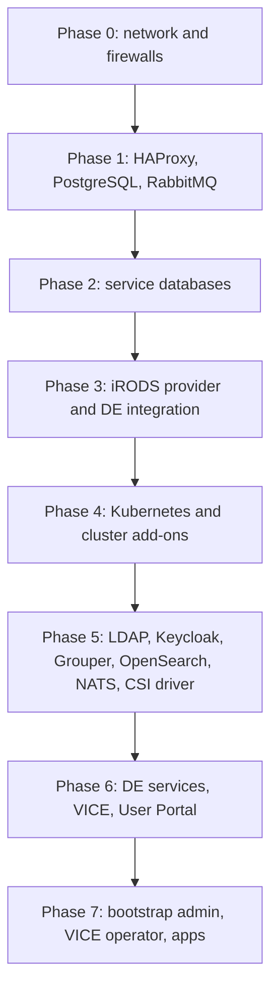

# Scope

This runbook builds a complete, self-contained CyVerse deployment on **two
servers** — the shape used for the most recent pilot. It is the narrative
companion to the per-component procedures under
[deployment](./index.md); every phase below links to the document that
carries the full detail.

A deployment of this size supports a working Discovery Environment (DE) with
VICE analyses, a single-provider iRODS zone, and one PostgreSQL instance shared
by the Data Store and the DE. Scaling out means adding worker nodes and
splitting roles onto more hosts; the order of operations does not change.

!!! info "Placeholders and secrets"

    Every site-specific value in this document is a placeholder. Substitute
    your own and keep the real values in a **private** inventory repository —
    never in this documentation and never in a public repo.

    | Placeholder | Meaning | Example |
    |-------------|---------|---------|
    | `<BASE_DOMAIN>` | DNS domain the deployment is served under | `example.org` |
    | `<SITE>` | Short site name used in realm, client, and account names | `pilot` |
    | `core-1` | Node hosting HAProxy, PostgreSQL, RabbitMQ, iRODS, k8s control plane, DE services | `core-1.<BASE_DOMAIN>` |
    | `analysis-1` | Node hosting VICE analyses | `analysis-1.<BASE_DOMAIN>` |
    | `<IRODS_ZONE>` | iRODS zone name | `pilotZone` |
    | `<LDAP_BASE_DN>` | LDAP base DN | `dc=example,dc=org` |
    | `<DEPLOYMENT_REPO>` | Your private inventory and group_vars repo | `<SITE>-deployment` |
    | `<GENERATED_SECRET>` | A value you generate per install, never reuse | output of `openssl rand -base64 36` |

    Generate every password, salt, zone key, and negotiation key at install
    time, for example with `openssl rand -base64 36` (passwords) or
    `openssl rand -hex 16` (alphanumeric keys and salts). Store them in the
    private inventory, and let Ansible template them into place rather than
    typing them into shells where they land in history.

    Deployment secrets that Ansible generates for you — the GPG and PEM files
    used by Terrain, apps, and iplant-groups — belong in the **private**
    inventory repository, not in this one.

# Node layout

Two servers, split by workload rather than by service:

| Node | Runs |
|------|------|
| `core-1` | HAProxy, PostgreSQL, RabbitMQ, iRODS provider, Kubernetes control plane, DE services (everything except analyses) |
| `analysis-1` | Kubernetes worker dedicated to VICE analyses |

Sizing, per-component reservations, and the dependency graph are in
[component inventory](../architecture/component-inventory.md). The ports that
must be open between the two nodes, to administrators, and to the public
internet are in
[network requirements](../architecture/network-requirements.md).

Reading the dependency graph from the bottom up gives the order the rest of
this document follows:



# Phase 0: network and firewalls

Do this first. Every later phase fails in a confusing way if a port is closed.

1. Confirm host firewalls on both nodes and any institutional firewall allow
   the traffic listed in
   [network requirements](../architecture/network-requirements.md).
2. Confirm `80/tcp` and `443/tcp` on `core-1` are reachable from everywhere
   users and VICE clients connect from.
3. Confirm iRODS (`1247/tcp` plus the `20000-20199` data range) is reachable
   from `analysis-1` and from any host that will move data in or out.
4. Confirm outbound HTTPS to your DNS provider's API is allowed, so
   cert-manager can complete Let's Encrypt DNS-01 challenges. This is optional
   but strongly recommended; without it, certificate issuance is manual.
5. Create the DNS records you will need: `de.<BASE_DOMAIN>`,
   `keycloak.<BASE_DOMAIN>`, `user.<BASE_DOMAIN>`, `vice.<BASE_DOMAIN>`, and a
   wildcard `*.vice.<BASE_DOMAIN>` for interactive apps.

# Phase 1: foundation services on `core-1`

Full procedures: [HAProxy](./01-foundation/haproxy.md),
[PostgreSQL](./01-foundation/postgresql.md),
[RabbitMQ](./01-foundation/rabbitmq.md).

## 1.1 HAProxy

Install HAProxy on `core-1`. It terminates public HTTPS on `443/tcp` and
forwards to the node ports Traefik listens on inside the cluster. Its
configuration depends on the Traefik node ports chosen in Phase 4, so install
the package now and configure it with the `haproxy` playbook tag later in that
phase.

## 1.2 PostgreSQL

One PostgreSQL instance backs both the iRODS catalog (iCAT) and every DE
service database.

1. Disable transparent huge pages: append `transparent_hugepage=never` to
   `GRUB_CMDLINE_LINUX_DEFAULT` in `/etc/default/grub`, run `update-grub`, and
   reboot.
2. Set kernel parameters persistently (`/etc/sysctl.d/`):
   `vm.nr_hugepages = 0.6 * (memory_available_to_postgres_in_kiB / 2048)` and
   `vm.swappiness = 5`.
3. Install `postgresql`, `postgresql-client`, and `python3-psycopg2`.
4. Apply the tuned `postgresql.conf` settings from
   [PostgreSQL](./01-foundation/postgresql.md#tuning) — they derive from the
   cores and memory you reserved for the database, so compute them from your
   own sizing rather than copying literals.
5. Restart PostgreSQL, then follow the iRODS project's instructions for
   preparing PostgreSQL for iRODS.[^irods-install]
6. Create a role for the DE with `SELECT` on all tables in the iCAT database,
   with a generated password.

!!! warning "`standard_conforming_strings`"

    The DE database expects `standard_conforming_strings = off`. If it is left
    on, some migrations do not apply; see
    [troubleshooting](./07-post-install/troubleshooting.md).

## 1.3 RabbitMQ

1. Install `rabbitmq-server`, enable the `rabbitmq_management` plugin, restart.
2. Create an administrator account with a generated password, grant it full
   configure/write/read permissions, and tag it `administrator`.
3. **Delete the default `guest` account.**
4. Create the vhost `/data-store` and grant the administrator full
   configure/write/read on it.
5. Create a separate account for iRODS with a generated password and full
   configure/write/read on `/data-store`.
6. Create a `topic` exchange named `irods` on `/data-store`.

The DE's own RabbitMQ objects are created later, in Phase 6, by the
`rabbitmq_configure.yml` playbook.

# Phase 2: service databases

Full procedures: [databases](./02-databases/index.md).

The iCAT database itself is created by the iRODS installer in Phase 3. The DE's
databases are created and migrated by Ansible in Phase 4 (the
`setup-databases` and `update-databases` tags), so at this point you only need
to make PostgreSQL reachable:

1. Set a password for the `postgres` role.
2. Edit `pg_hba.conf` to allow connections from your admin hosts and from both
   nodes, using method `scram-sha-256`.
3. Restart PostgreSQL.

The pod network cannot be allowed yet — its CIDR does not exist until the
cluster is created. Phase 4 comes back to `pg_hba.conf` for that.

# Phase 3: iRODS provider and DE integration

Full procedures: [iRODS provider](./03-data-store/irods-provider.md),
[DE integration](./03-data-store/de-integration.md).

## 3.1 Logging first

Create the rsyslog configuration **before** installing iRODS, so the first
server start is captured. Write `/etc/rsyslog.d/00-irods.conf`:

```
$FileCreateMode 0644
$DirCreateMode 0755
$Umask 0000
$template irods_format,"%msg%\n"
:programname,startswith,"irodsServer" /var/log/irods/irods.log;irods_format
& stop
:programname,startswith,"irodsDelayServer" /var/log/irods/irods.log;irods_format
& stop
:programname,startswith,"irodsAgent" /var/log/irods/irods.log;irods_format
& stop
```

Then add log rotation in `/etc/logrotate.d/irods`:

```
/var/log/irods/irods.log {
        weekly
        rotate 26
        copytruncate
        delaycompress
        compress
        dateext
        notifempty
        missingok
        su root root
}
```

## 3.2 Install the iRODS 4.3.3 catalog provider

1. Set TCP keepalive to 120 seconds with `sysctl`.
2. Install `python-is-python3` and `python3-pika`.
3. Add the iRODS apt repository[^irods-packages] and pin `irods-*` to
   `4.3.3` so an unattended upgrade cannot move the catalog provider.
4. Run the iRODS setup script[^irods-install] with the answers in
   [iRODS provider](./03-data-store/irods-provider.md#setup-answers) —
   service account `irods`, role `provider`, ODBC driver
   `PostgreSQL Unicode`, catalog on `localhost:5432`, zone `<IRODS_ZONE>`,
   port `1247`, data port range `20000-20199`.

   Three answers deserve care:

   * **Password salt** — a generated alphanumeric string. Never leave it
     empty; an empty salt makes stored passwords recoverable.
   * **Zone key** and **negotiation key** — generated alphanumeric strings;
     the zone key must be under 40 characters.
   * **Default resource name** — anything but `demoResc`, with its vault
     directory at the root of the filesystem that will hold the data.

## 3.3 Install CyVerse policy

From the [Data Store collection](https://github.com/cyverse/ds-collection)
branch that matches your site,[^ds-collection] as the `irods` service account:

1. Copy `playbooks/files/irods/var/lib/irods/msiExecCmd_bin/*` into
   `/var/lib/irods/msiExecCmd_bin/` and make them executable.
2. Render `playbooks/templates/irods/etc/irods/cyverse-env.re.j2` to
   `/etc/irods/cyverse-env.re`, setting `cyverse_RE_HOST` to the FQDN of
   `core-1` and `cyverse_ZONE` to `<IRODS_ZONE>`.
3. Copy `playbooks/files/etc/irods/*` into `/etc/irods/`.

Then edit `/etc/irods/server_config.json`:

```json
{
  "advanced_settings": {
    "number_of_concurrent_delay_rule_executors": 12
  },
  "environment_variables": {
    "IRODS_AMQP_URI": "amqp://<IRODS_AMQP_USER>:<GENERATED_SECRET>@localhost:5672/%2Fdata-store"
  },
  "plugin_configuration": {
    "rule_engines": [
      { "re_rulebase_set": ["cve", "cyverse_core", "core"] }
    ]
  }
}
```

The rule base order is significant: `cve` overrides `cyverse_core`, which
overrides `core`.

Enable the service so it starts at boot, and start it.

## 3.4 Runtime initialization

As the `irods` service account, with `<IRODS_ZONE>` substituted throughout:

1. Create the `rodsadmin` group and add `rods` to it. Remove the collections
   `/<IRODS_ZONE>/home/rodsadmin` and
   `/<IRODS_ZONE>/trash/home/rodsadmin` that group creation leaves behind.
2. Remove `/<IRODS_ZONE>/trash/home/public`.
3. Ensure the predefined collections `/<IRODS_ZONE>`, `/<IRODS_ZONE>/home`,
   `/<IRODS_ZONE>/home/public`, `/<IRODS_ZONE>/home/rods`,
   `/<IRODS_ZONE>/trash`, `/<IRODS_ZONE>/trash/home`, and
   `/<IRODS_ZONE>/trash/home/rods` all carry time-based (version 1) UUIDs.
4. Grant `rodsadmin` `write` on `/<IRODS_ZONE>`, `/<IRODS_ZONE>/home`,
   `/<IRODS_ZONE>/trash`, and `/<IRODS_ZONE>/trash/home`; grant it `own` on
   `/<IRODS_ZONE>/home/rods` and `/<IRODS_ZONE>/trash/home/rods`.
5. Create the `anonymous` `rodsuser` **without** a password and grant it
   `read` on `/<IRODS_ZONE>` and `/<IRODS_ZONE>/home`. This is what makes
   public data public.

## 3.5 Prepare iRODS for the DE

1. Install the DE's specific queries from
   `playbooks/files/irods/specific-queries` in the Data Store collection. Each
   file name is the query alias and the file contents are the query:

   ```bash
   iadmin asq "$(cat IPCCountCollectionsUnderPath.sql)" IPCCountCollectionsUnderPath
   ```

2. Create the DE's iRODS admin account:

   ```bash
   iadmin mkuser de-irods rodsadmin
   iadmin moduser de-irods password '<GENERATED_SECRET>'
   iadmin atg rodsadmin de-irods
   ```

# Phase 4: Kubernetes and cluster add-ons

Full procedures: [cluster](./04-kubernetes/cluster.md),
[resources](./04-kubernetes/resources.md),
[cert-manager](./04-kubernetes/cert-manager.md),
[ingress](./04-kubernetes/ingress.md), [storage](./04-kubernetes/storage.md),
[Harbor](./04-kubernetes/harbor.md), [Argo](./04-kubernetes/argo.md).

## 4.1 Inventory and group variables

Start from the example inventory in `ansible/example/inventory` in the
deployment playbook repository and copy it into your private
`<DEPLOYMENT_REPO>`:

| Inventory group | Contents for a two-node pilot |
|-----------------|-------------------------------|
| `01_condor` | empty — HTCondor is not used in this deployment |
| `02_dbms` | the database host; both groups may name the same host |
| `03_gocd` | empty — no GoCD in this deployment |
| `04_haproxy` | `core-1` |
| `05_k8s` | `core-1` in `k8s_api_proxy`, `k8s_controllers`, and `k8s_de_workers`; `analysis-1` in `k8s_vice_workers` |

`group_vars/all.yml` in the example inventory is organized in phases, because
some variables can only be filled in from values produced by earlier phases
(Keycloak client secrets, for example). Fill in phases 1 through 4 now.

## 4.2 Databases, node prep, HAProxy

Run from the `ansible` directory of the deployment playbook repository, with
`-i` pointing at your private inventory:

```bash
ansible-playbook -i /path/to/inventory --tags setup-databases,update-databases kubernetes.yml
ansible-playbook -i /path/to/inventory --tags prep-nodes kubernetes.yml
ansible-playbook -i /path/to/inventory --tags haproxy kubernetes.yml
```

The PostgreSQL installation role is skipped here on purpose: the Data Store's
DBMS from Phase 1 is being reused.

## 4.3 Create the k0s cluster

Write a `k0sctl.yaml` listing both hosts and the cluster settings — see
[cluster](./04-kubernetes/cluster.md#k0sctlyaml) for a sanitized example — then:

```bash
export K0S_SSH_USER=<SSH_USER>
export K0S_SSH_KEY_PATH=/path/to/private-key
export KUBECONFIG="$HOME/.kube/config"
mkdir -p "$(dirname "$KUBECONFIG")"
k0sctl apply --config /path/to/k0sctl.yaml
```

Because `core-1` is both control plane and DE worker, remove the control-plane
taint if k0s applied one. On the control node:

```bash
k0s kubectl taint node core-1 node-role.kubernetes.io/control-plane:NoSchedule-
```

If the node was never tainted, the command reports that there is nothing to
remove; that is the expected outcome, not an error to chase.

## 4.4 Cluster add-ons, in order

```bash
ansible-playbook -i /path/to/inventory --tags cert-manager   kubernetes.yml
ansible-playbook -i /path/to/inventory --tags cert-issuers   kubernetes.yml
ansible-playbook -i /path/to/inventory --tags argo           kubernetes.yml
ansible-playbook -i /path/to/inventory argo_resources.yml
ansible-playbook -i /path/to/inventory --tags ingress-nginx  kubernetes.yml
ansible-playbook -i /path/to/inventory --tags traefik        kubernetes.yml
ansible-playbook -i /path/to/inventory --tags longhorn       kubernetes.yml
ansible-playbook -i /path/to/inventory --tags harbor         kubernetes.yml
```

!!! note "ingress-nginx is transitional"

    Traefik is the ingress the deployment is standardizing on. ingress-nginx is
    still installed for VICE ingresses and will be removed once that migration
    completes. See [ingress](./04-kubernetes/ingress.md).

## 4.5 Let the pods reach PostgreSQL

The cluster now has a pod network, so add it to `pg_hba.conf`:

```bash
kubectl get nodes -o jsonpath='{.items[*].spec.podCIDR}' && echo
```

For each distinct CIDR, add a line to `pg_hba.conf` (in a Debian packaged
PostgreSQL 16 install, `/etc/postgresql/16/main/pg_hba.conf`):

```
host    all    all    <pod-cidr>    scram-sha-256
```

Restart PostgreSQL afterwards. In a single-node-per-role pilot the CIDRs are
usually identical, but check rather than assume.

# Phase 5: core services

Full procedures: [OpenLDAP](./05-core-services/openldap.md),
[Keycloak](./05-core-services/keycloak.md),
[Grouper](./05-core-services/grouper.md),
[OpenSearch](./05-core-services/opensearch.md),
[NATS](./05-core-services/nats.md),
[iRODS CSI driver](./05-core-services/irods-csi-driver.md).

## 5.1 DE prerequisites and directory services

```bash
ansible-playbook -i /path/to/inventory --tags de-reqs         kubernetes.yml
ansible-playbook -i /path/to/inventory --tags openldap-docker kubernetes.yml
```

## 5.2 Keycloak

```bash
ansible-playbook -i /path/to/inventory --tags keycloak kubernetes.yml
```

Add a DNS record for `keycloak.<BASE_DOMAIN>` if you have not already. An
`/etc/hosts` entry will get you through the next few steps, but it is not a
deployment.

The realm, LDAP federation, mappers, roles, and eight OAuth clients are then
configured in the Keycloak UI. That configuration is long, exact, and produces
the client secrets that later phases need in `group_vars/all.yml`, so it lives
in its own document: [Keycloak](./05-core-services/keycloak.md). Complete it
before continuing.

## 5.3 Service signing keys

From the same directory you run `ansible-playbook` from:

```bash
./scripts/generate-secrets.sh /path/to/inventory
```

This writes the GPG and PEM files Terrain, apps, and iplant-groups expect, and
prints a YAML snippet to add to `group_vars/all.yml`. Commit the generated key
material to your **private** inventory repository only.

## 5.4 Configuration, ingress, networking, messaging

```bash
ansible-playbook -i /path/to/inventory \
  --tags=configure-services,ingress,networking,nats kubernetes.yml
```

If NATS has to be reinstalled, Helm may still hold a release record; remove it
with `helm -n prod uninstall nats` before re-running.

## 5.5 Scheduling, caching, search, groups, storage

```bash
ansible-playbook -i /path/to/inventory \
  --tags=feature-discovery,image-cache,grouper kubernetes.yml
ansible-playbook -i /path/to/inventory --tags=opensearch       kubernetes.yml
ansible-playbook -i /path/to/inventory --tags=irods-csi-driver kubernetes.yml
```

Node feature discovery labels nodes by capability (GPUs, for instance) so apps
that need specific hardware land on the right worker. Image caching pre-pulls
frequently used VICE images so interactive apps start promptly.

## 5.6 DE messaging objects

```bash
ansible-playbook -i /path/to/inventory rabbitmq_configure.yml
```

# Phase 6: applications

Full procedures:
[Discovery Environment](./06-applications/discovery-environment.md),
[VICE](./06-applications/vice.md),
[User Portal](./06-applications/user-portal.md).

```bash
ansible-playbook -i /path/to/inventory --tags=deploy-all-services kubernetes.yml
```

This deploys the full DE service set, the User Portal, and the VICE backend.
Watch for pods that never reach `Running`:

```bash
kubectl get pods -A | grep -Ev 'Running|Completed'
```

# Phase 7: bootstrap and first analyses

Full procedures: [bootstrap](./07-post-install/bootstrap.md),
[verification](./07-post-install/verification.md),
[troubleshooting](./07-post-install/troubleshooting.md).

## 7.1 Bootstrap portal administrator

```bash
ansible-playbook -i /path/to/inventory bootstrap_portal_admin.yml
```

Run this from a host that can both `kubectl port-forward` into the cluster and
reach the portal database with `psql`. The playbook port-forwards to OpenLDAP
and portal-conductor and connects to the portal database directly, so a
`pg_hba.conf` rule for that host has to exist. Getting this far means the
port-forwarding half already works; the database half is the one that bites.

This creates the `<SITE>-bootstrap` user, the account you use for everything
below.

## 7.2 Register a VICE operator

Interactive analyses will not launch until an operator is registered.

1. Log in to `https://de.<BASE_DOMAIN>` as `<SITE>-bootstrap`.
2. Open the left navigation from the hamburger menu, then
   **Admin → VICE → Operators**.
3. Click **+New** and set:
   * **Name**: `prod`
   * **URL**: `http://vice-operator.vice-apps:10000` — plain HTTP is correct
     here; the connection never leaves the cluster network.
   * **Public base URL**: `https://vice.<BASE_DOMAIN>`
   * **Priority**: `0`
4. Click **Register operator**.

## 7.3 Import a starting set of apps

The `scripts/appei` directory of the deployment repository exports and imports
apps and tools between DEs, and manages its dependencies with
[uv](https://docs.astral.sh/uv/). From that directory:

```bash
uv run appei login  --server de.<BASE_DOMAIN> --username <SITE>-bootstrap
uv run appei import --server de.<BASE_DOMAIN> -i de-word-count.json --publish
uv run appei import --server de.<BASE_DOMAIN> -i cloudshell.json --featured
uv run appei import --server de.<BASE_DOMAIN> -i portal-delete-user.json
```

The result, as `<SITE>-bootstrap`:

| App | Visibility |
|-----|------------|
| DE Word Count | public, not featured |
| Cloud Shell | featured, and therefore public |
| portal-delete-user | private to the bootstrap account |

`portal-delete-user` needs a configuration file attached before it will run;
[bootstrap](./07-post-install/bootstrap.md#portal-delete-user) covers that,
and [troubleshooting](./07-post-install/troubleshooting.md) covers repairing
the import if it lands with the wrong visibility.

## 7.4 Verify

Work through [verification](./07-post-install/verification.md): sign in
through Keycloak, browse the Data Store, run the DE Word Count app on a small
input, and launch Cloud Shell to confirm VICE end to end.

[^irods-install]: iRODS 4.3.3 installation guide
[^irods-packages]: iRODS package repository setup
[^ds-collection]: CyVerse Data Store collection (playbooks and iRODS policy)
[^pilot-record]: Pilot CyVerse deployment record
