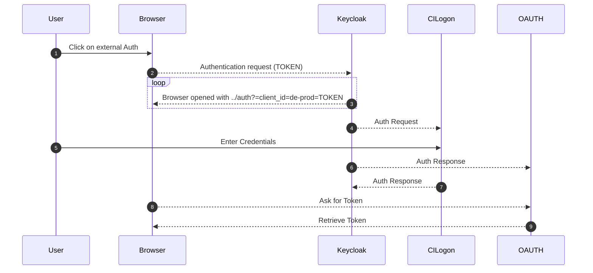
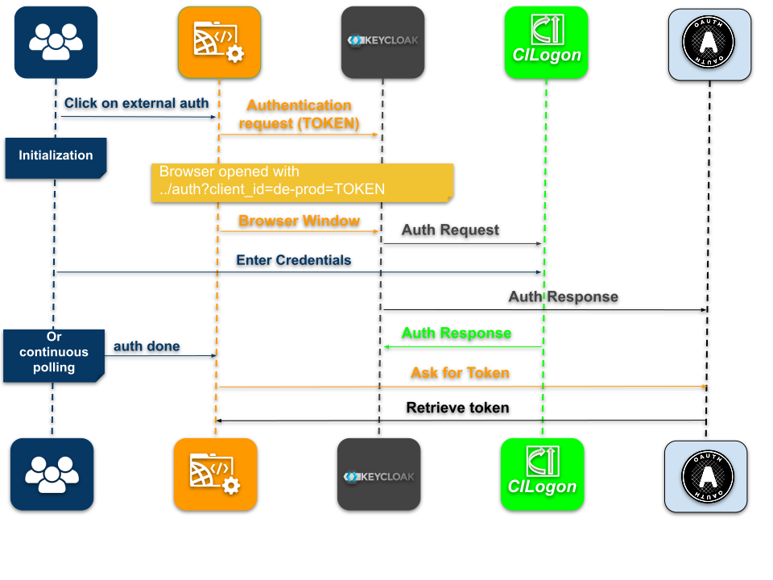

# How CyVerse authenticates users

CyVerse authenticates through [Keycloak](https://www.keycloak.org/){target=_blank},
which brokers to [CILogon](https://cilogon.org/){target=_blank} for federated
institutional identity and to OAuth 2.0 providers such as Google, GitHub, and
ORCID.

[comment]: <> ()

Users start at the left: the browser is redirected to Keycloak, which brokers the request to CILogon or an OAuth provider, and the token comes back through the browser.

The public US deployment runs Keycloak at
[kc.cyverse.org](https://kc.cyverse.org){target=_blank}.

## Deployment

Keycloak runs in the Kubernetes cluster, in its own namespace. Deploying and
configuring it — realm, LDAP federation, mappers, realm roles, and the OAuth
clients each CyVerse application needs — is covered in
[Keycloak deployment](../deployment/05-core-services/keycloak.md). Its database is
[the Keycloak database](../deployment/02-databases/keycloak.md), and the account
directory it federates is [OpenLDAP](../deployment/05-core-services/openldap.md).

## Using it from an API client

Terrain accepts OAuth and OIDC tokens issued by Keycloak; see
[Terrain](../api/terrain.md) for how clients obtain one.

The provisioning playbooks live in
[ansible-kubernetes-keycloak](https://github.com/cyverse/ansible-kubernetes-keycloak){target=_blank}.

## Related

* [Keycloak deployment](../deployment/05-core-services/keycloak.md)
* [OpenLDAP](../deployment/05-core-services/openldap.md)
* [Terrain](../api/terrain.md)
