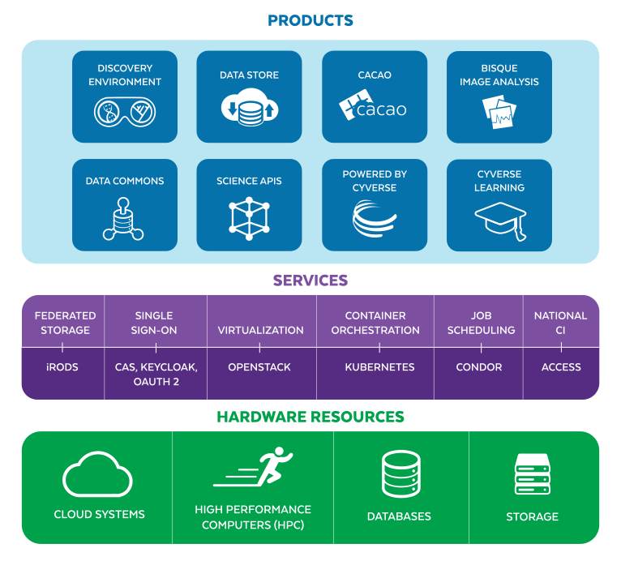

# Products and services

The user-facing layer of CyVerse. These documents describe what each service *is*;
building them is covered in [deployment/](../deployment/).

<figure markdown>
  {width=800}
  <figcaption>The CyVerse layer cake: hardware, then services, then products</figcaption>
</figure>

# Data

* [Data Store](data-store.md) - iRODS storage with WebDAV, SFTP, and API access
* [Data Commons](data-commons.md) - publishing curated and community-released datasets

# Compute

* [Discovery Environment](discovery-environment.md) - the web-based data science workbench
* [Cloud services](cloud.md) - CACAO infrastructure-as-code for multi-cloud deployments

# Specialized applications

* [BisQue](bisque.md) - bio-image semantic query and analysis
* [DNA Subway](dna-subway.md) - educational genomics workflows

# Platform services

* [Authentication](authentication.md) - Keycloak, CILogon, and OAuth 2.0
* [Subscriptions](subscriptions.md) - resource allocations and how they are managed
* [Terrain API](../api/terrain.md) - the API every product is built on
