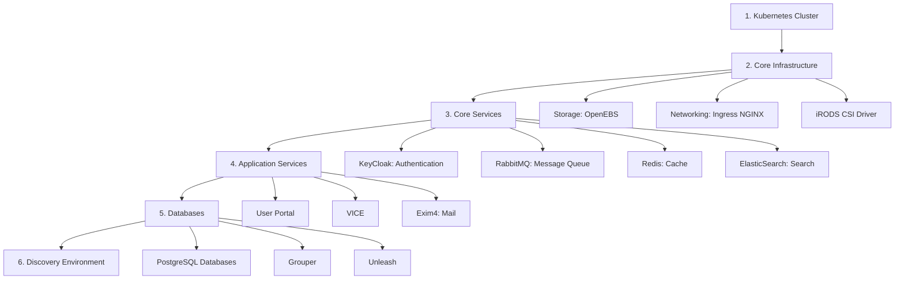

# Getting Started with CyVerse Deployment

This guide will help you get started with deploying and managing CyVerse infrastructure. Choose the path that matches your role and objectives.

## Prerequisites

!!! Success "Infrastructure Requirements"

    **Hardware/Cloud:**

    * Access to bare metal hardware, :simple-openstack: OpenStack cloud, or commercial provider (:simple-amazonaws: AWS, :simple-googlecloud: Google Cloud, :simple-azuredevops: Microsoft Azure)
    * Minimum recommended: 8-node Kubernetes cluster with 32 CPU cores and 128GB RAM per node
    * Persistent storage capability (NFS, iRODS, or cloud block storage)
    * Public IP addresses and DNS management

    **Skills & Knowledge:**

    * Advanced understanding of :simple-linux: Linux system administration and file permissions
    * Experience with :simple-kubernetes: Kubernetes (K8s) cluster management
    * Familiarity with :simple-docker: Docker containerization
    * Understanding of Infrastructure as Code (IaC) principles
    * Experience with :simple-ansible: Ansible for configuration management
    * Networking knowledge (DNS, load balancing, ingress controllers)

    **Tools & Access:**

    * :simple-github: GitHub or :simple-gitlab: GitLab with private repositories for sensitive credentials
    * `kubectl`, `helm`, and other Kubernetes CLI tools
    * Access via `ssh` to infrastructure nodes
    * Web-enabled browser for administrative interfaces

    **Personal Qualities:**

    * Patience & Perseverance - complex distributed systems require methodical troubleshooting

## Deployment Roadmap

Deploying CyVerse follows a structured sequence. Each component builds upon the previous layers:

### Component Dependencies

| Component | Depends On | Purpose |
|-----------|------------|---------|
| Kubernetes Cluster | Hardware/Cloud | Container orchestration foundation |
| OpenEBS | Kubernetes | Persistent volume management |
| Ingress NGINX | Kubernetes | External traffic routing |
| KeyCloak | Kubernetes, PostgreSQL | User authentication and authorization |
| RabbitMQ | Kubernetes | Message passing between services |
| Redis HA | Kubernetes | Caching and session management |
| ElasticSearch | Kubernetes | Full-text search capabilities |
| Discovery Environment | All core services | Main user-facing application |
| VICE | DE, Kubernetes | Interactive computing environments |

### Deployment Phases

**Phase 1: Foundation (Weeks 1-2)**
- Set up Kubernetes cluster
- Deploy storage (OpenEBS) and networking (Ingress NGINX)
- Configure iRODS CSI driver for data storage
- Verify cluster health and resource allocation

**Phase 2: Core Services (Week 3)**
- Deploy and configure KeyCloak for authentication
- Set up RabbitMQ message broker
- Deploy Redis HA for caching
- Configure ElasticSearch for search functionality
- Deploy monitoring (Jaeger)

**Phase 3: Databases (Week 4)**
- Provision PostgreSQL databases for all services
- Initialize database schemas
- Configure backup and recovery procedures
- Set up Grouper for group management
- Deploy Unleash for feature flags

**Phase 4: Applications (Weeks 5-6)**
- Deploy User Portal
- Configure Discovery Environment services
- Set up VICE for interactive applications
- Deploy mail services (Exim4)
- Configure external integrations

**Phase 5: Verification & Tuning (Week 7)**
- End-to-end testing
- Performance optimization
- Security hardening
- Documentation of deployment specifics

---

## Quick Start by Role

### :material-server: For DevOps Engineers

**Goal: Deploy CyVerse infrastructure from scratch**

#### 1. Prepare Your Environment

Start with the setup guides to configure your deployment tools:

- [Ansible Setup](../guides/setup/ansible.md) - Configure Ansible for infrastructure automation
- [Docker Setup](../guides/setup/docker.md) - Set up Docker and container registry access
- [Database Setup](../guides/setup/database.md) - Prepare PostgreSQL deployment tools

#### 2. Deploy Core Infrastructure

Follow the deployment sequence:

1. **[Kubernetes Cluster](../deployments/kubernetes-deploy.md)** - Deploy and configure your K8s cluster
2. **[Kubernetes Resources](../deployments/k8s-resources.md)** - Set up namespaces, resource quotas, and RBAC
3. **[Storage (OpenEBS)](../deployments/openebs.md)** - Deploy persistent volume management
4. **[iRODS CSI Driver](../deployments/irods-csi-driver.md)** - Connect to iRODS data storage
5. **[Networking](../deployments/ingress-nginx.md)** - Configure ingress for external access

#### 3. Deploy Services

With infrastructure in place, deploy the service layer:

1. **[KeyCloak](../deployments/keycloak.md)** - Authentication and identity management
2. **[RabbitMQ](../deployments/RabbitMQ.md)** - Message broker for service communication
3. **[Redis HA](../deployments/redis-ha.md)** - High-availability caching
4. **[ElasticSearch](../deployments/elasticsearch.md)** - Search engine
5. **[Databases](../database/main.md)** - PostgreSQL for all services

#### 4. Deploy Applications

Finally, deploy the user-facing applications:

1. **[Discovery Environment](../deployments/DiscoveryEnvironment.md)** - Main DE platform
2. **[User Portal](../deployments/userportal.md)** - User account management interface
3. **[VICE](../deployments/vice.md)** - Interactive computing

#### 5. Verify Deployment

- Check all pods are running: `kubectl get pods --all-namespaces`
- Verify services are accessible through ingress
- Test authentication flow through KeyCloak
- Review logs for errors: `kubectl logs -n <namespace> <pod-name>`

**Next Steps:**
- Review [DevOps operational procedures](../guides/devops.md)
- Set up monitoring and alerting
- Configure backup procedures for databases
- Plan disaster recovery procedures

---

### :octicons-people-24: For System Administrators

**Goal: Manage users, apps, and daily operations**

#### 1. Understand the Platform

Before managing CyVerse, familiarize yourself with the architecture:

- [System Overview](system_overview.md) - How CyVerse components work together
- [Discovery Environment](de.md) - The main user-facing platform
- [Data Store](ds.md) - iRODS-based data management

#### 2. Learn Administrative Tools

Review the admin guides for operational procedures:

- **[DE Administration](../guides/de.md)** - User management, app publishing, VICE access grants
- **[Data Store Administration](../guides/ds.md)** - Data permissions, storage management
- **[User Portal Administration](../guides/user_portal.md)** - Account management

#### 3. Common Administrative Tasks

**User Management:**
- Grant VICE access to qualified users
- Manage user quotas and resource limits
- Process user support requests

**App Publishing:**
- Review and approve tool integration requests
- Publish containerized apps to the Discovery Environment
- Test and validate app functionality

**Data Management:**
- Process Permanent ID/DOI requests for data publishing
- Manage data sharing permissions
- Monitor storage usage and quotas

#### 4. Resources

- **[FAQ](../guides/faq.md)** - Common questions and troubleshooting
- **[Permanent ID Requests](../services/api/endpoints/permanent-id-requests.md)** - DOI workflow documentation
- **[Terrain API](../services/api_overview.md)** - Understanding the backend API

**Next Steps:**
- Bookmark frequently used admin interfaces
- Join CyVerse staff communication channels
- Review common user support scenarios
- Familiarize yourself with escalation procedures

---

### :material-code-braces: For Application Developers

**Goal: Integrate with CyVerse APIs or contribute to the platform**

#### 1. Understand the API Architecture

Start with API fundamentals:

- **[API Overview](api_overview.md)** - Introduction to Terrain API
- **[API Endpoint Index](../services/api/endpoint-index.md)** - Complete endpoint reference
- **[Developer Guide](../development/index.md)** - Development environment setup

#### 2. Authentication & Access

Learn how to authenticate with CyVerse services:

- **[Authentication (KeyCloak)](keycloak.md)** - OAUTH 2.0 flow and token management
- **[Error Handling](../services/api/errors.md)** - API error codes and responses

#### 3. Common Integration Patterns

**Data Operations:**
- [Filesystem API](../services/api/endpoints/filesystem/directory-listing.md) - Browse and manage data in the Data Store
- [File I/O](../services/api/endpoints/fileio.md) - Upload and download files
- [Metadata](../services/api/endpoints/filesystem/metadata.md) - Attach metadata to data objects

**Compute Operations:**
- [App Metadata](../services/api/endpoints/app-metadata.md) - Query available analysis tools
- [Job Submission](../services/api/endpoints/endpoints.md) - Launch computational analyses
- [Callbacks](../services/api/endpoints/callbacks.md) - Receive job status updates

**User Interactions:**
- [Notifications](../services/api/endpoints/notifications.md) - Send messages to users
- [Comments](../services/api/endpoints/comments.md) - Enable collaborative annotations
- [Favorites](../services/api/endpoints/favorites.md) - Manage user bookmarks

#### 4. Contributing to CyVerse

If you're contributing code to CyVerse:

- Review the **[Developer Guide](../development/index.md)** for contribution workflow
- Browse the [CyVerse-DE GitHub organization](https://github.com/cyverse-de){target=_blank}
- Test against the [live Terrain API](https://de.cyverse.org/terrain/docs/){target=_blank}

**Migration Guides:**
- [Tapis v2 to v3 Migration](../services/api/tapis-v2-v3-migration.md) - Upgrade from legacy Tapis APIs

**Next Steps:**
- Set up a CyVerse development account
- Review API rate limits and usage policies
- Explore example integrations in GitHub
- Join developer community channels

---

## Installation Tools

The [DevOps Guide](../guides/devops.md) provides a complete list of required software for managing a CyVerse deployment, including:

- Kubernetes CLI tools (`kubectl`, `helm`)
- Ansible for configuration management
- Docker for container operations
- Database administration tools
- Monitoring and logging tools

---

## Technology Stack Overview

### Authentication

CyVerse authentication relies upon:
- [LDAP](https://en.wikipedia.org/wiki/Lightweight_Directory_Access_Protocol) - Directory services for user accounts
- [OAUTH 2.0 protocol](https://www.rfc-editor.org/rfc/rfc6749) - Modern authentication standard
- [CILogon](https://www.cilogon.org/home) - Federated identity for research institutions

See [KeyCloak](keycloak.md) for authentication deployment details.

### :octicons-shield-24: Security Considerations

Experience operating in a [Science DMZ](https://en.wikipedia.org/wiki/Science_DMZ_Network_Architecture) network architecture is beneficial for deploying CyVerse on university infrastructure. Key security topics include:

- Firewall rules for high-performance data transfer
- Network segmentation between public and private services
- TLS certificate management for secure communications
- Secrets management for API keys and credentials

### Core APIs

[:material-terrain: Terrain API](api_overview.md) is the backbone service aggregating all Discovery Environment functionality. It provides a unified RESTful interface for:

- Data management (Data Store operations)
- App execution (job submission and monitoring)
- User services (preferences, notifications, favorites)
- Administrative functions (user management, resource allocation)

Detailed endpoint documentation is available in the [API endpoints section](api/endpoints/endpoints.md).

### Platform Components

**User-Facing Products:**

- **[Discovery Environment](de.md)** - Web-based data science workbench with 1000+ pre-integrated tools
- **[Data Store](ds.md)** - 6+ PB iRODS-based storage with data management, hosting, and sharing
- **[Data Commons](dc.md)** - Community data repository with DataCite DOI publishing
- **[VICE](../deployments/vice.md)** - Visual Interactive Computing (Jupyter, RStudio, Shiny apps)
- **[BisQue](bisque.md)** - Browser-based large image analysis platform
- **[DNA Subway](dnasubway.md)** - Educational genomics software for students

**Backend Services:**

- **[Core Services](services_overview.md)** - Microservices architecture overview
- **[Authentication (KeyCloak)](keycloak.md)** - Identity and access management
- **[Cloud Services (CACAO)](cloud.md)** - Multi-cloud automation and orchestration

### :simple-kubernetes: Deployment Platform

All CyVerse services are deployed on [Kubernetes (K8s)](../deployments/deployment_overview.md) using:

- Helm charts for package management
- Ansible playbooks for configuration
- GitOps practices for infrastructure as code
- Namespace isolation for service boundaries

See the complete [Deployments overview](../deployments/deployment_overview.md) for details.

### :octicons-database-24: Database Infrastructure

CyVerse uses [:simple-postgresql: PostgreSQL](https://www.postgresql.org/) as its primary database platform. Each service maintains its own database for isolation and independent scaling:

- [DE Database](../database/de-db.md) - Discovery Environment core data
- [Metadata Database](../database/metadata-db.md) - User-defined metadata
- [Notifications Database](../database/notifications-db.md) - User notification system
- [KeyCloak Database](../database/keycloak-db.md) - Authentication data
- [And more...](../database/main.md)

---

## Next Steps

After completing your getting started tasks:

1. **Verify Deployment** - Test core functionality end-to-end
2. **Review Troubleshooting Resources** - Familiarize yourself with common issues in the [FAQ](../guides/faq.md)
3. **Set Up Monitoring** - Implement logging and alerting for production operations
4. **Join the Community** - Connect with other CyVerse operators and developers via [GitHub](https://github.com/cyverse-de){target=_blank}
5. **Plan for Scale** - Review performance tuning and capacity planning for your workload

**Need Help?**

- Check the [FAQ](../guides/faq.md) for common questions
- Review deployment-specific documentation in the [Deployment Guide](../deployments/deployment_overview.md)
- Explore the [API Reference](api_overview.md) for integration details
- Consult the [Developer Guide](../development/index.md) for contribution workflow
