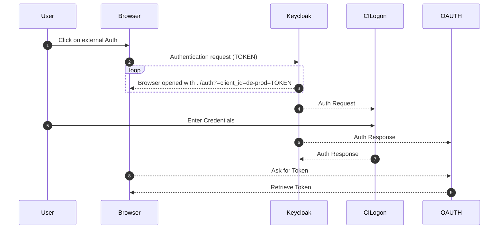

CyVerse Authentication via Keycloak, CILogon, & OAUTH 

[comment]: <> ()

**Mermaid Diagram** Users authenticate (starting on left side) via their browser, which passes through Keycloack to either CILogon or OAUTH.

[:material-shield-key: Keycloak](https://kc.cyverse.org){target=_blank} service manages authenticaation via [CILogon](https://cilogon.org/){target=_blank} and [OAUTH](https://oauth.net/){target=_blank}.

## Keycloak

Keycloak is provisioned and deployed as part of the main K8s 

[:simple-github: Keycloak](https://github.com/cyverse/ansible-kubernetes-keycloak){target=_blank} provisioning with K8s